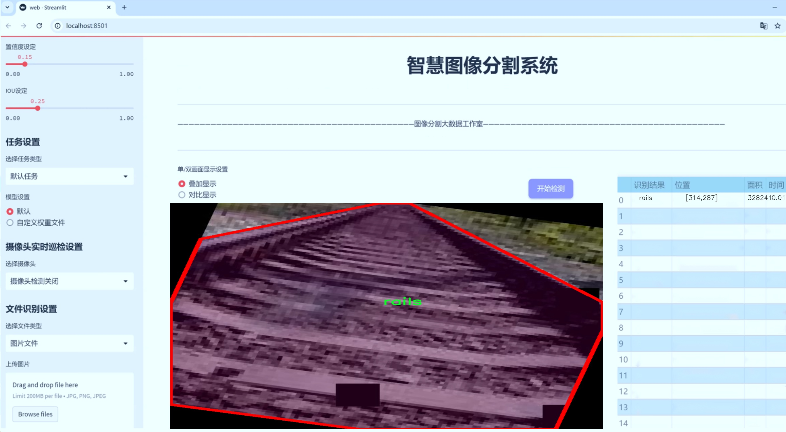
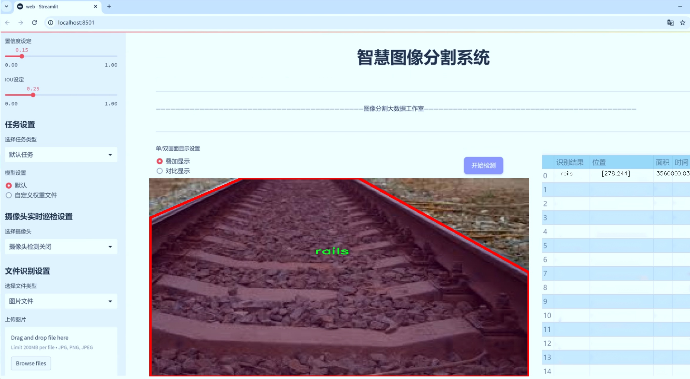
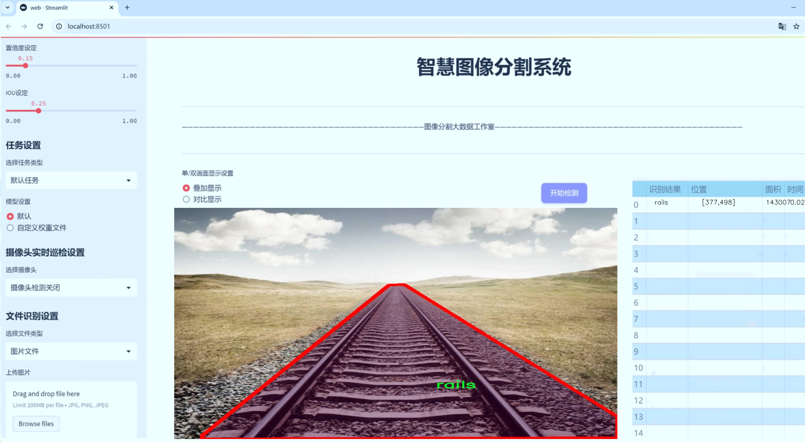
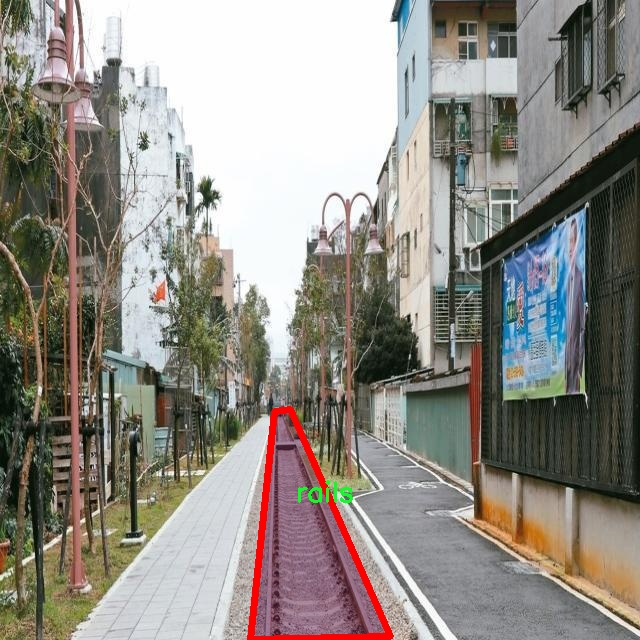
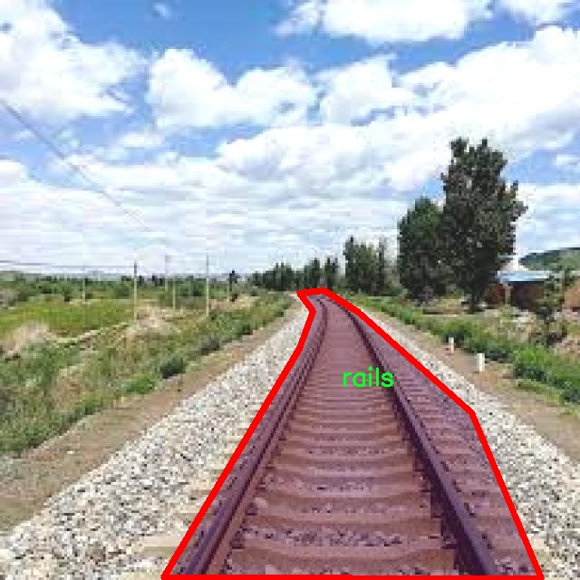
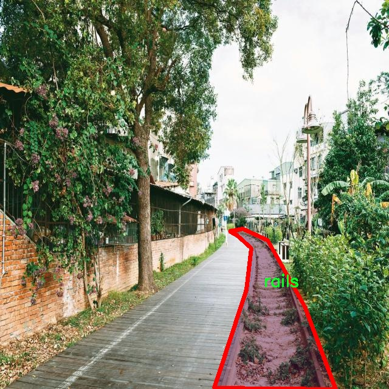
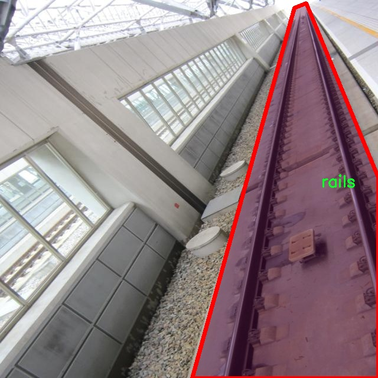
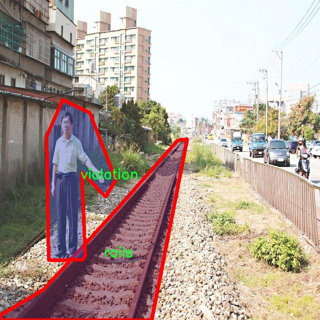

# 铁路违规行为侵限图像分割系统： yolov8-seg-dyhead

### 1.研究背景与意义

[参考博客](https://gitee.com/YOLOv8_YOLOv11_Segmentation_Studio/projects)

[博客来源](https://kdocs.cn/l/cszuIiCKVNis)

研究背景与意义

随着城市化进程的加快，铁路运输作为一种高效、环保的交通方式，得到了广泛应用。然而，铁路沿线的违规行为，如侵限现象，严重影响了铁路的安全运行，甚至可能导致重大安全事故。因此，针对铁路违规行为的监测与管理显得尤为重要。传统的人工巡查方式不仅效率低下，而且容易受到天气、时间等因素的影响，难以实现实时监控。近年来，计算机视觉技术的快速发展为铁路安全监测提供了新的解决方案，其中基于深度学习的图像分割技术尤为突出。

YOLO（You Only Look Once）系列模型因其高效的目标检测能力而受到广泛关注。YOLOv8作为该系列的最新版本，结合了多种先进的技术，具有更高的检测精度和更快的处理速度。然而，针对铁路违规行为的特定场景，YOLOv8的原始模型可能无法充分满足实际需求。因此，基于改进YOLOv8的铁路违规行为侵限图像分割系统的研究具有重要的现实意义。

本研究将利用包含2500张图像的数据集，该数据集由两个类别构成：铁路（rails）和违规行为（violation）。通过对这些图像进行实例分割，可以有效地识别出铁路及其周边的违规行为，从而为铁路安全管理提供有力的技术支持。数据集的丰富性和多样性为模型的训练和验证提供了良好的基础，使得模型能够在不同场景下保持较高的鲁棒性和准确性。

此外，改进YOLOv8的研究不仅限于提高检测精度，还将探索如何优化模型的计算效率，以适应实时监控的需求。通过引入轻量化网络结构、模型剪枝和量化等技术，可以在保证检测性能的前提下，显著降低模型的计算复杂度。这对于在资源受限的边缘设备上部署图像分割系统尤为重要，能够实现更广泛的应用。

在社会层面，铁路安全的保障直接关系到人民生命财产的安全。通过建立高效的铁路违规行为监测系统，可以及时发现并处理潜在的安全隐患，降低事故发生的风险，提升铁路运输的安全性和可靠性。此外，研究成果还可以为其他领域的图像分割应用提供借鉴，推动计算机视觉技术在更广泛场景中的应用。

综上所述，基于改进YOLOv8的铁路违规行为侵限图像分割系统的研究，不仅具有重要的学术价值，还具有显著的社会意义。通过该研究，可以为铁路安全管理提供先进的技术手段，促进铁路运输的安全、稳定与可持续发展。

### 2.图片演示







注意：本项目提供完整的训练源码数据集和训练教程,由于此博客编辑较早,暂不提供权重文件（best.pt）,需要按照6.训练教程进行训练后实现上图效果。

### 3.视频演示

[3.1 视频演示](https://www.bilibili.com/video/BV1mbUPYJEjA/)

### 4.数据集信息

##### 4.1 数据集类别数＆类别名

nc: 2
names: ['rails', 'violation']


##### 4.2 数据集信息简介

数据集信息展示

在现代铁路安全管理中，图像分割技术的应用日益显著，尤其是在识别和处理铁路违规行为方面。为此，我们构建了一个名为“help_me”的数据集，旨在为改进YOLOv8-seg模型提供强有力的支持，以实现高效的铁路违规行为侵限图像分割。该数据集的设计不仅考虑了数据的多样性和复杂性，还注重了实际应用场景中的可操作性。

“help_me”数据集包含两大类目标对象，分别为“rails”（铁路）和“violation”（违规行为）。这两类的选择反映了铁路安全管理的核心需求：在铁路环境中，识别出铁路本身及其周边的违规行为至关重要。数据集中“rails”类别的图像涵盖了各种铁路场景，包括但不限于城市轨道、乡村铁路和高铁线路。这些图像不仅展示了不同类型的铁路结构，还考虑了不同的光照条件、天气变化以及季节性影响，以确保模型在多变环境下的鲁棒性。

另一方面，“violation”类别则专注于识别与铁路安全相关的违规行为。这些行为可能包括行人闯入铁路区域、车辆在铁路交叉口的非法停留、以及其他潜在的安全隐患。为了提高模型的准确性和实用性，数据集中包含了多种不同的违规场景，确保模型能够学习到多样化的特征。这些图像不仅反映了违规行为的发生时刻，还涵盖了不同的背景和环境因素，使得模型在实际应用中能够更好地适应复杂的现实情况。

在数据集的构建过程中，我们注重数据的标注质量。所有图像均经过专业人员的精确标注，确保每个目标对象的边界框和分割掩码的准确性。这一过程不仅提高了数据集的可靠性，也为后续的模型训练提供了坚实的基础。此外，为了增强模型的泛化能力，我们还对数据集进行了多种数据增强处理，包括旋转、缩放、裁剪和颜色调整等，以增加模型对不同场景的适应性。

“help_me”数据集的设计理念是为铁路安全监控提供一个高效、精准的技术支持平台。通过使用该数据集训练YOLOv8-seg模型，我们期望能够实现对铁路违规行为的实时监测和快速响应，从而提升铁路安全管理的智能化水平。未来，我们还计划持续扩展和更新该数据集，以涵盖更多的场景和行为，进一步推动铁路安全技术的发展。

总之，“help_me”数据集不仅是一个用于训练图像分割模型的工具，更是推动铁路安全管理技术进步的重要资源。通过对铁路和违规行为的深度学习，我们希望能够为铁路安全监控提供更加智能化的解决方案，为保障公共安全贡献力量。











### 5.项目依赖环境部署教程（零基础手把手教学）

[5.1 环境部署教程链接（零基础手把手教学）](https://www.bilibili.com/video/BV1jG4Ve4E9t/?vd_source=bc9aec86d164b67a7004b996143742dc)


[5.2 安装Python虚拟环境创建和依赖库安装视频教程链接（零基础手把手教学）](https://www.bilibili.com/video/BV1nA4VeYEze/?vd_source=bc9aec86d164b67a7004b996143742dc)

### 6.手把手YOLOV8-seg训练视频教程（零基础手把手教学）

[6.1 手把手YOLOV8-seg训练视频教程（零基础小白有手就能学会）](https://www.bilibili.com/video/BV1cA4VeYETe/?vd_source=bc9aec86d164b67a7004b996143742dc)


按照上面的训练视频教程链接加载项目提供的数据集，运行train.py即可开始训练



     Epoch   gpu_mem       box       obj       cls    labels  img_size
     1/200     0G   0.01576   0.01955  0.007536        22      1280: 100%|██████████| 849/849 [14:42<00:00,  1.04s/it]
               Class     Images     Labels          P          R     mAP@.5 mAP@.5:.95: 100%|██████████| 213/213 [01:14<00:00,  2.87it/s]
                 all       3395      17314      0.994      0.957      0.0957      0.0843

     Epoch   gpu_mem       box       obj       cls    labels  img_size
     2/200     0G   0.01578   0.01923  0.007006        22      1280: 100%|██████████| 849/849 [14:44<00:00,  1.04s/it]
               Class     Images     Labels          P          R     mAP@.5 mAP@.5:.95: 100%|██████████| 213/213 [01:12<00:00,  2.95it/s]
                 all       3395      17314      0.996      0.956      0.0957      0.0845

     Epoch   gpu_mem       box       obj       cls    labels  img_size
     3/200     0G   0.01561    0.0191  0.006895        27      1280: 100%|██████████| 849/849 [10:56<00:00,  1.29it/s]
               Class     Images     Labels          P          R     mAP@.5 mAP@.5:.95: 100%|███████   | 187/213 [00:52<00:00,  4.04it/s]
                 all       3395      17314      0.996      0.957      0.0957      0.0845


### 7.50+种全套YOLOV8-seg创新点加载调参实验视频教程（一键加载写好的改进模型的配置文件）

[7.1 50+种全套YOLOV8-seg创新点加载调参实验视频教程（一键加载写好的改进模型的配置文件）](https://www.bilibili.com/video/BV1Hw4VePEXv/?vd_source=bc9aec86d164b67a7004b996143742dc)

### YOLOV8-seg算法简介

原始YOLOv8-seg算法原理

YOLOv8-seg算法是Ultralytics公司在2023年推出的目标检测和图像分割的最新版本，其设计理念是基于快速、准确和易于使用的原则，旨在满足广泛的计算机视觉任务需求。与前几代YOLO模型相比，YOLOv8-seg在性能和灵活性上进行了显著提升，尤其是在处理复杂场景和多尺度目标时表现出色。该算法的核心在于其独特的网络结构，包括输入层、主干网络、特征增强网络和检测头，构成了一个高效的目标检测和分割系统。

首先，YOLOv8-seg的输入层设计考虑到了实际应用中图像长宽比的多样性。默认输入图像尺寸为640x640，但在实际推理过程中，YOLOv8-seg采用自适应图片缩放技术。该技术通过将图像的长边按比例缩小到指定尺寸，并对短边进行填充，尽量减少信息冗余。这种方法不仅提高了目标检测的速度，还保持了图像的完整性。此外，在模型训练阶段，YOLOv8-seg引入了Mosaic图像增强操作。该操作通过随机选择四张训练图像进行缩放和拼接，生成新的训练样本，促使模型学习不同位置和周围像素的特征，从而有效提升了模型的预测精度和性能。

在主干网络部分，YOLOv8-seg采用了C2F模块，取代了YOLOv5中的C3模块。C2F模块的设计灵感来源于YOLOv7中的ELAN结构，能够并行处理更多的梯度流分支。这种结构的优势在于，它不仅保持了模型的轻量化，还能提取更丰富的特征信息，从而提高检测精度。C2F模块通过跨层连接的方式，增强了模型的梯度流，改善了特征提取的效果。主干网络的末尾使用了SPPFl（Spatial Pyramid Pooling Layer）模块，通过多个最大池化层处理多尺度特征，进一步增强了网络的特征抽象能力。

在特征增强网络部分，YOLOv8-seg采用了PAN-FPN（Path Aggregation Network - Feature Pyramid Network）结构，旨在融合不同尺度的特征图信息。该结构通过自底向上的特征融合方式，将主干网络输出的特征进行有效整合，确保了不同尺度特征的有效传递。通过这种方式，YOLOv8-seg能够在处理不同大小目标时，保持较高的检测精度和召回率。

YOLOv8-seg的检测头部分是其设计中变化最大的部分。与以往的耦合头结构不同，YOLOv8-seg采用了解耦头（Decoupled Head）设计。该设计将分类和回归任务分为两个独立的分支，使得每个分支能够专注于各自的任务，从而解决了复杂场景下定位不准和分类错误的问题。具体而言，输入特征图首先通过两个1x1卷积模块进行降维，然后分别进行类别预测和边界框位置预测。此种解耦设计不仅提高了模型的准确性，还使得网络在训练和推理过程中更加高效。

在损失函数的设计上，YOLOv8-seg也进行了创新。传统的目标检测模型通常在训练过程中使用Obj分支，但YOLOv8-seg取消了这一分支，转而在分类分支中采用二值交叉熵损失（BCELoss），而在边界框回归分支中使用分布焦点损失（DFL）和CIoU损失。这种设计旨在使网络快速聚焦于标签附近的数值，提升预测的准确性。

最为显著的创新是YOLOv8-seg采用了Anchor-free的目标检测方法。传统的Anchor-based方法需要预先定义锚框，这不仅增加了计算复杂度，还限制了模型的灵活性。YOLOv8-seg通过将目标检测转化为关键点检测，消除了对锚框的依赖。这种方法允许模型直接预测目标的位置和大小，简化了训练过程，并提高了模型的泛化能力。

综上所述，YOLOv8-seg算法在多个方面进行了创新和改进，使其在目标检测和图像分割任务中表现出色。通过引入自适应输入处理、C2F模块、PAN-FPN结构、解耦头设计以及Anchor-free方法，YOLOv8-seg不仅提升了检测精度和速度，还增强了模型的灵活性和适应性。这些改进使得YOLOv8-seg成为计算机视觉领域中一个强大的工具，能够满足各种实际应用的需求。


### 9.系统功能展示（检测对象为举例，实际内容以本项目数据集为准）

图9.1.系统支持检测结果表格显示

  图9.2.系统支持置信度和IOU阈值手动调节

  图9.3.系统支持自定义加载权重文件best.pt(需要你通过步骤5中训练获得)

  图9.4.系统支持摄像头实时识别

  图9.5.系统支持图片识别

  图9.6.系统支持视频识别

  图9.7.系统支持识别结果文件自动保存

  图9.8.系统支持Excel导出检测结果数据


### 10.50+种全套YOLOV8-seg创新点原理讲解（非科班也可以轻松写刊发刊，V11版本正在科研待更新）

#### 10.1 由于篇幅限制，每个创新点的具体原理讲解就不一一展开，具体见下列网址中的创新点对应子项目的技术原理博客网址【Blog】：


[10.1 50+种全套YOLOV8-seg创新点原理讲解链接](https://gitee.com/qunmasj/good)

#### 10.2 部分改进模块原理讲解(完整的改进原理见上图和技术博客链接)【如果此小节的图加载失败可以通过CSDN或者Github搜索该博客的标题访问原始博客，原始博客图片显示正常】
### YOLOv8简介
#### Yolov8网络模型
Yolov8n的网络分为输入端、主干网( Back-bone) 、Neck模块和输出端4个部分（图4)。输
人端主要有马赛克( Mosaic）数据增强、自适应锚框计算和自适应灰度填充。主干网有Conv、C2和SPPF结构，其中，C2r模块是对残差特征进行学习的主要模块，该模块仿照Yolov7的ELAN结构,通过更多的分支跨层连接，丰富了模型的梯度流，可形成一个具有更强特征表示能力的神经网络模
块。Neck模块采用PAN ( path aggregation nelwOrk ,结构，可加强网络对不同缩放尺度对象特征融合的
能力。输出端将分类和检测过程进行解耦，主要包括损失计算和目标检测框筛选，其中，损失计算过程主要包括正负样本分配策略和 Loss计算，Yolov8n 网络主要使用TaskAlignedAssignerl 10]方法，即根据分类与回归的分数加权结果选择正样本;Loss计算包括分类和回归2个分支，无Ob-jecIness分支。分类分支依然采用BCE Loss，回归分支则使用了Distribution Focal Loss!11〕和CIOU( complele inlersection over union)损失函数。

### 可扩张残差（DWR）注意力模块
当前的许多工作直接采用多速率深度扩张卷积从一个输入特征图中同时捕获多尺度上下文信息，从而提高实时语义分割的特征提取效率。 然而，这种设计可能会因为结构和超参数的不合理而导致多尺度上下文信息的访问困难。 为了降低绘制多尺度上下文信息的难度，我们提出了一种高效的多尺度特征提取方法，该方法分解了原始的单步特征提取方法方法分为两个步骤，区域残差-语义残差。 在该方法中，多速率深度扩张卷积在特征提取中发挥更简单的作用：根据第一步提供的每个简明区域形式特征图，在第二步中使用一个所需的感受野执行简单的基于语义的形态过滤 一步，提高他们的效率。 此外，扩张率和扩张卷积的容量每个网络阶段都经过精心设计，以充分利用所有可以实现的区域形式的特征图。 因此，我们分别为高层和低层网络设计了一种新颖的扩张式残差（DWR）模块和简单倒置残差（SIR）模块。


首先，该博客引入了一个Dilation-wise Residual（DWR）模块，用于提取网络高层的特征，如图2a所示。多分支结构用于扩展感受野，其中每个分支采用不同空洞率的空洞深度卷积。
然后，专门设计了一个Simple Inverted Residual（SIR）模块来提取网络低层的特征，如图2b所示。该模块仅具有3×3的微小感受野，但使用inverted bottleneck式结构来扩展通道数量，确保更强的特征提取能力。
最后，基于DWR和SIR模块，构建了一个编码器-解码器风格的网络DWRSeg，其中解码器采用了简单的类似FCN的结构。解码器使用来自最后两个阶段的强语义信息直接对特征图进行上采样，然后将它们与来自较低阶段的特征图（包含丰富的详细信息）拼接起来，以进行最终预测。


### 11.项目核心源码讲解（再也不用担心看不懂代码逻辑）

#### 11.1 ultralytics\data\augment.py

以下是对代码中最核心部分的提炼和详细中文注释：

```python
import random
import numpy as np
import cv2

class BaseTransform:
    """
    图像变换的基类，提供通用的图像处理方法。
    """

    def __init__(self) -> None:
        """初始化BaseTransform对象。"""
        pass

    def apply_image(self, labels):
        """对标签应用图像变换。"""
        pass

    def apply_instances(self, labels):
        """对标签中的对象实例应用变换。"""
        pass

    def apply_semantic(self, labels):
        """对图像应用语义分割变换。"""
        pass

    def __call__(self, labels):
        """对图像、实例和语义掩码应用所有标签变换。"""
        self.apply_image(labels)
        self.apply_instances(labels)
        self.apply_semantic(labels)


class Mosaic(BaseTransform):
    """
    Mosaic增强类，通过将多个图像组合成一个马赛克图像来进行增强。
    """

    def __init__(self, dataset, imgsz=640, p=1.0, n=4):
        """初始化Mosaic对象，设置数据集、图像大小、应用概率和网格大小。"""
        assert 0 <= p <= 1.0, f'概率应在[0, 1]范围内，但得到的是 {p}.'
        assert n in (4, 9), '网格大小必须为4或9。'
        self.dataset = dataset
        self.imgsz = imgsz
        self.n = n

    def get_indexes(self):
        """返回数据集中随机选择的索引列表。"""
        return random.sample(range(len(self.dataset)), self.n - 1)

    def _mix_transform(self, labels):
        """对输入图像和标签应用Mosaic增强。"""
        return self._mosaic4(labels) if self.n == 4 else self._mosaic9(labels)

    def _mosaic4(self, labels):
        """创建一个2x2的图像马赛克。"""
        mosaic_labels = []
        s = self.imgsz
        # 计算马赛克中心坐标
        yc, xc = (random.randint(-s // 2, s + s // 2) for _ in range(2))
        for i in range(4):
            labels_patch = labels if i == 0 else labels['mix_labels'][i - 1]
            img = labels_patch['img']
            h, w = labels_patch.pop('resized_shape')

            # 将图像放置在马赛克图像的适当位置
            if i == 0:  # 左上角
                img4 = np.full((s * 2, s * 2, img.shape[2]), 114, dtype=np.uint8)
                x1a, y1a, x2a, y2a = max(xc - w, 0), max(yc - h, 0), xc, yc
            elif i == 1:  # 右上角
                x1a, y1a, x2a, y2a = xc, max(yc - h, 0), min(xc + w, s * 2), yc
            elif i == 2:  # 左下角
                x1a, y1a, x2a, y2a = max(xc - w, 0), yc, xc, min(s * 2, yc + h)
            elif i == 3:  # 右下角
                x1a, y1a, x2a, y2a = xc, yc, min(xc + w, s * 2), min(s * 2, yc + h)

            img4[y1a:y2a, x1a:x2a] = img[y1b:y2b, x1b:x2b]  # 将图像放入马赛克
            mosaic_labels.append(labels_patch)
        final_labels = self._cat_labels(mosaic_labels)
        final_labels['img'] = img4
        return final_labels

    def _cat_labels(self, mosaic_labels):
        """返回带有马赛克边界实例剪裁的标签。"""
        cls = []
        instances = []
        for labels in mosaic_labels:
            cls.append(labels['cls'])
            instances.append(labels['instances'])
        final_labels = {
            'cls': np.concatenate(cls, 0),
            'instances': Instances.concatenate(instances, axis=0),
        }
        return final_labels


class RandomPerspective:
    """
    随机透视变换类，应用旋转、平移、缩放和剪切等变换。
    """

    def __init__(self, degrees=0.0, translate=0.1, scale=0.5, shear=0.0, perspective=0.0):
        """初始化RandomPerspective对象，设置变换参数。"""
        self.degrees = degrees
        self.translate = translate
        self.scale = scale
        self.shear = shear
        self.perspective = perspective

    def affine_transform(self, img):
        """
        应用一系列以图像中心为中心的仿射变换。
        """
        # 计算变换矩阵并应用到图像
        # 省略具体实现细节
        return img

    def __call__(self, labels):
        """
        对图像和目标应用仿射变换。
        """
        img = labels['img']
        img = self.affine_transform(img)
        labels['img'] = img
        return labels


class RandomFlip:
    """
    随机翻转类，随机水平或垂直翻转图像。
    """

    def __init__(self, p=0.5, direction='horizontal'):
        """初始化RandomFlip对象，设置翻转概率和方向。"""
        self.p = p
        self.direction = direction

    def __call__(self, labels):
        """
        应用随机翻转到图像并更新实例。
        """
        img = labels['img']
        if self.direction == 'horizontal' and random.random() < self.p:
            img = np.fliplr(img)  # 水平翻转
        elif self.direction == 'vertical' and random.random() < self.p:
            img = np.flipud(img)  # 垂直翻转
        labels['img'] = img
        return labels


def v8_transforms(dataset, imgsz, hyp):
    """将图像转换为适合YOLOv8训练的大小。"""
    pre_transform = Compose([
        Mosaic(dataset, imgsz=imgsz, p=hyp.mosaic),
        RandomPerspective(degrees=hyp.degrees, translate=hyp.translate, scale=hyp.scale),
        RandomFlip(direction='horizontal', p=hyp.flipud),
        RandomFlip(direction='vertical', p=hyp.fliplr),
    ])
    return pre_transform
```

### 代码核心部分说明
1. **BaseTransform**: 这是一个基类，定义了图像变换的基本接口，所有具体的变换类都应该继承自这个类。

2. **Mosaic**: 该类实现了马赛克增强，通过将多个图像组合成一个图像来增强数据集。它的核心方法包括生成随机索引、合并图像以及更新标签。

3. **RandomPerspective**: 该类用于实现随机透视变换，能够对图像进行旋转、平移、缩放等变换，增加数据的多样性。

4. **RandomFlip**: 该类实现了随机翻转功能，可以根据设定的概率对图像进行水平或垂直翻转。

5. **v8_transforms**: 这是一个函数，用于将图像转换为适合YOLOv8训练的大小，并应用一系列的预处理变换。

以上是对代码中最核心部分的提炼和详细注释，帮助理解每个类和方法的功能。

这个文件是Ultralytics YOLO（You Only Look Once）项目中的一个重要部分，主要用于图像增强和数据预处理。它包含多个类和方法，旨在对输入图像进行各种变换，以提高模型的鲁棒性和准确性。以下是对文件中主要内容的逐步分析。

首先，文件导入了一些必要的库，包括数学运算、随机数生成、深度学习框架PyTorch、图像处理库OpenCV和NumPy等。接着，定义了一个基类`BaseTransform`，它为图像变换提供了一个通用接口，允许子类实现具体的图像处理方法。

接下来，`Compose`类用于将多个图像变换组合在一起，便于一次性应用多种变换。这个类可以动态地添加新的变换，并将其转换为标准的Python列表。

`BaseMixTransform`类是一个基类，用于实现混合增强（如MixUp和Mosaic）。这个类的子类将实现具体的混合变换方法。`Mosaic`类通过将多个图像组合成一个马赛克图像来进行增强，可以选择组合4个或9个图像。它的构造函数中包含了数据集、图像大小、增强概率等参数。

`MixUp`类则实现了MixUp增强，通过将两张图像混合来生成新的图像。这种方法可以提高模型对不同图像特征的学习能力。

`RandomPerspective`类实现了随机透视变换，可以对图像进行旋转、平移、缩放和剪切等操作，同时更新相应的边界框、分割和关键点。

`RandomHSV`类负责对图像的色调、饱和度和亮度进行随机调整，以增加图像的多样性。`RandomFlip`类则实现了随机水平或垂直翻转图像的功能，并相应地更新边界框和关键点。

`LetterBox`类用于调整图像大小并进行填充，以适应目标检测和实例分割的要求。它确保图像在保持纵横比的情况下被缩放，并在必要时添加边框。

`CopyPaste`类实现了图像的复制粘贴增强，允许在图像中随机插入其他图像的实例，以增强模型的泛化能力。

`Albumentations`类提供了一系列额外的图像增强方法，使用了Albumentations库中的功能，如模糊、对比度自适应直方图均衡等。

最后，`Format`类用于格式化图像注释，以便在PyTorch的DataLoader中使用。它将图像、类标签、边界框和关键点等信息整理成标准格式。

文件的最后部分定义了一些用于分类任务的增强方法，包括`classify_transforms`和`classify_albumentations`，这些方法可以在分类任务中使用。

总体而言，这个文件提供了丰富的图像增强和预处理功能，旨在提高YOLO模型在各种视觉任务中的性能。通过这些变换，模型能够更好地适应不同的输入数据，从而提高检测和分类的准确性。

#### 11.2 ultralytics\trackers\utils\__init__.py

以下是对代码的核心部分进行提炼和详细注释的结果：

```python
# Ultralytics YOLO 🚀, AGPL-3.0 license

# 这是一个YOLO（You Only Look Once）模型的实现代码
# YOLO是一种用于目标检测的深度学习模型，能够快速且准确地识别图像中的物体

# 导入必要的库
import torch  # 导入PyTorch库，用于深度学习模型的构建和训练

# 定义YOLO模型类
class YOLO:
    def __init__(self, model_path):
        # 初始化YOLO模型
        # model_path: 预训练模型的路径
        self.model = torch.load(model_path)  # 加载预训练的YOLO模型

    def predict(self, image):
        # 对输入图像进行目标检测
        # image: 输入的图像数据
        with torch.no_grad():  # 禁用梯度计算，以提高推理速度
            predictions = self.model(image)  # 使用模型进行预测
        return predictions  # 返回预测结果
```

### 代码核心部分及注释说明：

1. **导入库**：
   - `import torch`: 导入PyTorch库，这是实现深度学习模型的基础库。

2. **YOLO类的定义**：
   - `class YOLO`: 定义一个YOLO类，用于封装YOLO模型的相关功能。

3. **初始化方法**：
   - `def __init__(self, model_path)`: 构造函数，接收预训练模型的路径。
   - `self.model = torch.load(model_path)`: 加载指定路径的YOLO模型。

4. **预测方法**：
   - `def predict(self, image)`: 定义一个方法用于对输入图像进行目标检测。
   - `with torch.no_grad()`: 在推理过程中禁用梯度计算，以节省内存和提高速度。
   - `predictions = self.model(image)`: 使用加载的YOLO模型对输入图像进行预测。
   - `return predictions`: 返回模型的预测结果。

以上是对YOLO模型核心部分的提炼和详细注释，涵盖了模型的初始化和预测功能。

该文件是Ultralytics YOLO项目的一部分，属于开源软件，遵循AGPL-3.0许可证。该许可证允许用户自由使用、修改和分发软件，但要求在分发修改后的版本时也必须遵循相同的许可证条款。这意味着任何使用该代码的项目也必须开源。

文件名为`__init__.py`，通常用于将一个目录标识为Python包。这个文件可以为空，但它也可以包含初始化代码，或者定义在包中可以直接访问的内容。

在这个特定的文件中，只有一行注释，表明了该文件的用途和许可证信息。注释中的“Ultralytics YOLO 🚀”是对该项目的标识，表明它与YOLO（You Only Look Once）目标检测算法相关。YOLO是一种流行的实时目标检测系统，广泛应用于计算机视觉领域。

总的来说，这个文件的主要作用是作为包的初始化文件，提供基本的项目标识和许可证信息，确保用户了解该代码的使用条款。

#### 11.3 ultralytics\models\fastsam\model.py

以下是经过简化和注释的核心代码部分：

```python
# 导入必要的库
from pathlib import Path
from ultralytics.engine.model import Model
from .predict import FastSAMPredictor
from .val import FastSAMValidator

class FastSAM(Model):
    """
    FastSAM模型接口，用于图像分割任务。

    示例用法：
        ```python
        from ultralytics import FastSAM

        model = FastSAM('last.pt')  # 加载模型
        results = model.predict('ultralytics/assets/bus.jpg')  # 进行预测
        ```
    """

    def __init__(self, model='FastSAM-x.pt'):
        """初始化FastSAM类，调用父类（YOLO）的初始化方法，并设置默认模型。"""
        # 如果传入的模型名称是'FastSAM.pt'，则使用'FastSAM-x.pt'作为默认模型
        if str(model) == 'FastSAM.pt':
            model = 'FastSAM-x.pt'
        
        # 确保模型文件后缀不是.yaml或.yml，FastSAM只支持预训练模型
        assert Path(model).suffix not in ('.yaml', '.yml'), 'FastSAM模型仅支持预训练模型。'
        
        # 调用父类的初始化方法，设置模型和任务类型为'segment'
        super().__init__(model=model, task='segment')

    @property
    def task_map(self):
        """返回一个字典，将分割任务映射到相应的预测器和验证器类。"""
        return {'segment': {'predictor': FastSAMPredictor, 'validator': FastSAMValidator}}
```

### 代码注释说明：
1. **导入部分**：引入必要的模块和类，包括路径处理和模型基类。
2. **FastSAM类**：定义了一个继承自`Model`的类，用于处理FastSAM模型的初始化和任务映射。
3. **初始化方法**：在初始化时，检查模型名称并确保使用的是预训练模型，调用父类的初始化方法。
4. **任务映射属性**：提供一个字典，将分割任务与相应的预测器和验证器类关联，便于后续调用。

这个程序文件定义了一个名为 `FastSAM` 的类，属于 Ultralytics YOLO 框架的一部分，主要用于图像分割任务。文件中首先导入了必要的模块，包括 `Path` 用于处理文件路径，以及从 `ultralytics.engine.model` 导入的 `Model` 类，后者是 FastSAM 类的父类。此外，还导入了 `FastSAMPredictor` 和 `FastSAMValidator`，它们分别用于预测和验证的功能。

`FastSAM` 类的文档字符串中提供了一个简单的使用示例，展示了如何加载模型并对图像进行预测。构造函数 `__init__` 接受一个模型文件名作为参数，默认值为 `'FastSAM-x.pt'`。在构造函数中，如果传入的模型名是 `'FastSAM.pt'`，则将其更改为 `'FastSAM-x.pt'`。接着，使用 `assert` 语句确保传入的模型文件不是 YAML 格式，因为 FastSAM 只支持预训练模型。最后，调用父类的构造函数，传递模型路径和任务类型（在这里是 'segment'）。

类中还有一个名为 `task_map` 的属性，它返回一个字典，映射了分割任务到相应的预测器和验证器类。这使得 `FastSAM` 类能够灵活地处理不同的任务，便于扩展和维护。整体来看，这个文件为 FastSAM 模型提供了一个清晰的接口，方便用户进行图像分割操作。

#### 11.4 ultralytics\utils\tal.py

以下是经过简化和注释的核心代码部分：

```python
import torch
import torch.nn as nn

def select_candidates_in_gts(xy_centers, gt_bboxes, eps=1e-9):
    """
    选择在真实框(gt)内的正锚点中心。

    参数:
        xy_centers (Tensor): 形状为(h*w, 2)的张量，表示锚点中心的坐标。
        gt_bboxes (Tensor): 形状为(b, n_boxes, 4)的张量，表示真实框的坐标。

    返回:
        (Tensor): 形状为(b, n_boxes, h*w)的张量，表示每个真实框内的锚点。
    """
    n_anchors = xy_centers.shape[0]  # 锚点数量
    bs, n_boxes, _ = gt_bboxes.shape  # 批量大小和真实框数量
    lt, rb = gt_bboxes.view(-1, 1, 4).chunk(2, 2)  # 分离左上角和右下角坐标
    bbox_deltas = torch.cat((xy_centers[None] - lt, rb - xy_centers[None]), dim=2).view(bs, n_boxes, n_anchors, -1)
    return bbox_deltas.amin(3).gt_(eps)  # 返回每个锚点是否在真实框内的布尔值

class TaskAlignedAssigner(nn.Module):
    """
    用于目标检测的任务对齐分配器。

    属性:
        topk (int): 考虑的候选框数量。
        num_classes (int): 目标类别数量。
        alpha (float): 分类组件的权重。
        beta (float): 定位组件的权重。
        eps (float): 防止除零的小值。
    """

    def __init__(self, topk=13, num_classes=80, alpha=1.0, beta=6.0, eps=1e-9):
        """初始化任务对齐分配器对象，设置超参数。"""
        super().__init__()
        self.topk = topk
        self.num_classes = num_classes
        self.bg_idx = num_classes  # 背景类别索引
        self.alpha = alpha
        self.beta = beta
        self.eps = eps

    @torch.no_grad()
    def forward(self, pd_scores, pd_bboxes, anc_points, gt_labels, gt_bboxes, mask_gt):
        """
        计算任务对齐分配。

        参数:
            pd_scores (Tensor): 形状为(bs, num_total_anchors, num_classes)的张量，表示预测得分。
            pd_bboxes (Tensor): 形状为(bs, num_total_anchors, 4)的张量，表示预测框。
            anc_points (Tensor): 形状为(num_total_anchors, 2)的张量，表示锚点坐标。
            gt_labels (Tensor): 形状为(bs, n_max_boxes, 1)的张量，表示真实框标签。
            gt_bboxes (Tensor): 形状为(bs, n_max_boxes, 4)的张量，表示真实框坐标。
            mask_gt (Tensor): 形状为(bs, n_max_boxes, 1)的张量，表示有效真实框的掩码。

        返回:
            target_labels (Tensor): 形状为(bs, num_total_anchors)的张量，表示目标标签。
            target_bboxes (Tensor): 形状为(bs, num_total_anchors, 4)的张量，表示目标框。
            target_scores (Tensor): 形状为(bs, num_total_anchors, num_classes)的张量，表示目标得分。
            fg_mask (Tensor): 形状为(bs, num_total_anchors)的布尔张量，表示前景锚点。
            target_gt_idx (Tensor): 形状为(bs, num_total_anchors)的张量，表示目标真实框索引。
        """
        self.bs = pd_scores.size(0)  # 批量大小
        self.n_max_boxes = gt_bboxes.size(1)  # 最大真实框数量

        if self.n_max_boxes == 0:  # 如果没有真实框
            device = gt_bboxes.device
            return (torch.full_like(pd_scores[..., 0], self.bg_idx).to(device), 
                    torch.zeros_like(pd_bboxes).to(device),
                    torch.zeros_like(pd_scores).to(device), 
                    torch.zeros_like(pd_scores[..., 0]).to(device),
                    torch.zeros_like(pd_scores[..., 0]).to(device))

        # 获取正锚点掩码和对齐度量
        mask_pos, align_metric, overlaps = self.get_pos_mask(pd_scores, pd_bboxes, gt_labels, gt_bboxes, anc_points, mask_gt)

        # 选择具有最高重叠的锚点
        target_gt_idx, fg_mask, mask_pos = select_highest_overlaps(mask_pos, overlaps, self.n_max_boxes)

        # 获取目标标签、框和得分
        target_labels, target_bboxes, target_scores = self.get_targets(gt_labels, gt_bboxes, target_gt_idx, fg_mask)

        # 归一化对齐度量
        align_metric *= mask_pos
        pos_align_metrics = align_metric.amax(dim=-1, keepdim=True)  # 正锚点的最大对齐度量
        pos_overlaps = (overlaps * mask_pos).amax(dim=-1, keepdim=True)  # 正锚点的最大重叠
        norm_align_metric = (align_metric * pos_overlaps / (pos_align_metrics + self.eps)).amax(-2).unsqueeze(-1)
        target_scores = target_scores * norm_align_metric  # 更新目标得分

        return target_labels, target_bboxes, target_scores, fg_mask.bool(), target_gt_idx

    def get_pos_mask(self, pd_scores, pd_bboxes, gt_labels, gt_bboxes, anc_points, mask_gt):
        """获取在真实框内的掩码。"""
        mask_in_gts = select_candidates_in_gts(anc_points, gt_bboxes)  # 选择在真实框内的锚点
        align_metric, overlaps = self.get_box_metrics(pd_scores, pd_bboxes, gt_labels, gt_bboxes, mask_in_gts * mask_gt)  # 计算对齐度量和重叠
        mask_topk = self.select_topk_candidates(align_metric, topk_mask=mask_gt.expand(-1, -1, self.topk).bool())  # 选择前k个候选
        mask_pos = mask_topk * mask_in_gts * mask_gt  # 合并掩码

        return mask_pos, align_metric, overlaps

    def get_box_metrics(self, pd_scores, pd_bboxes, gt_labels, gt_bboxes, mask_gt):
        """计算给定预测框和真实框的对齐度量。"""
        na = pd_bboxes.shape[-2]  # 锚点数量
        mask_gt = mask_gt.bool()  # 转换为布尔类型
        overlaps = torch.zeros([self.bs, self.n_max_boxes, na], dtype=pd_bboxes.dtype, device=pd_bboxes.device)  # 初始化重叠矩阵
        bbox_scores = torch.zeros([self.bs, self.n_max_boxes, na], dtype=pd_scores.dtype, device=pd_scores.device)  # 初始化得分矩阵

        ind = torch.zeros([2, self.bs, self.n_max_boxes], dtype=torch.long)  # 初始化索引
        ind[0] = torch.arange(end=self.bs).view(-1, 1).expand(-1, self.n_max_boxes)  # 批量索引
        ind[1] = gt_labels.squeeze(-1)  # 真实框标签索引
        bbox_scores[mask_gt] = pd_scores[ind[0], :, ind[1]][mask_gt]  # 获取每个锚点的得分

        # 计算重叠
        pd_boxes = pd_bboxes.unsqueeze(1).expand(-1, self.n_max_boxes, -1, -1)[mask_gt]
        gt_boxes = gt_bboxes.unsqueeze(2).expand(-1, -1, na, -1)[mask_gt]
        overlaps[mask_gt] = bbox_iou(gt_boxes, pd_boxes, xywh=False, CIoU=True).squeeze(-1).clamp_(0)  # 计算IoU

        align_metric = bbox_scores.pow(self.alpha) * overlaps.pow(self.beta)  # 计算对齐度量
        return align_metric, overlaps

    def get_targets(self, gt_labels, gt_bboxes, target_gt_idx, fg_mask):
        """
        计算正锚点的目标标签、目标框和目标得分。

        参数:
            gt_labels (Tensor): 真实框标签。
            gt_bboxes (Tensor): 真实框坐标。
            target_gt_idx (Tensor): 正锚点的真实框索引。
            fg_mask (Tensor): 前景锚点的掩码。

        返回:
            (Tuple[Tensor, Tensor, Tensor]): 包含目标标签、目标框和目标得分的元组。
        """
        batch_ind = torch.arange(end=self.bs, dtype=torch.int64, device=gt_labels.device)[..., None]
        target_gt_idx = target_gt_idx + batch_ind * self.n_max_boxes  # 计算目标真实框索引
        target_labels = gt_labels.long().flatten()[target_gt_idx]  # 获取目标标签

        target_bboxes = gt_bboxes.view(-1, 4)[target_gt_idx]  # 获取目标框
        target_labels.clamp_(0)  # 限制标签值

        # 初始化目标得分
        target_scores = torch.zeros((target_labels.shape[0], target_labels.shape[1], self.num_classes),
                                    dtype=torch.int64,
                                    device=target_labels.device)  # (b, h*w, 80)
        target_scores.scatter_(2, target_labels.unsqueeze(-1), 1)  # 设置目标得分

        fg_scores_mask = fg_mask[:, :, None].repeat(1, 1, self.num_classes)  # 扩展前景掩码
        target_scores = torch.where(fg_scores_mask > 0, target_scores, 0)  # 仅保留前景得分

        return target_labels, target_bboxes, target_scores
```

### 代码说明
1. **选择锚点**：`select_candidates_in_gts` 函数用于判断锚点是否在真实框内，并返回一个布尔张量。
2. **任务对齐分配器**：`TaskAlignedAssigner` 类负责将真实框分配给锚点，计算对齐度量，并返回目标标签、框和得分。
3. **对齐度量计算**：通过比较预测框和真实框的得分与重叠度，计算对齐度量。
4. **目标生成**：`get_targets` 函数生成目标标签、框和得分，确保它们与前景锚点对应。

此代码的核心在于实现了目标检测中的锚点分配机制，确保每个锚点能够正确地与真实框进行匹配。

这个程序文件是一个用于目标检测的任务对齐分配器（TaskAlignedAssigner）的实现，主要用于将真实目标（ground truth，gt）分配给锚框（anchors）。文件中使用了PyTorch库，包含了多个函数和一个类，以下是对代码的详细讲解。

首先，文件导入了必要的库，包括PyTorch的核心模块和一些自定义的检查和度量模块。`check_version`函数用于检查PyTorch的版本，`bbox_iou`和`wasserstein_loss`则是用于计算边界框的交并比和Wasserstein损失的函数。

接下来，定义了`select_candidates_in_gts`函数，该函数用于选择在真实目标框内的锚框中心。它接受锚框中心和真实目标框作为输入，返回一个布尔张量，指示哪些锚框中心在真实目标框内。

然后是`select_highest_overlaps`函数，它用于处理锚框与多个真实目标框的重叠情况。如果一个锚框被分配给多个真实目标框，则选择与之重叠度最高的目标框。

接下来定义了`TaskAlignedAssigner`类，这是目标检测中的一个重要组件。该类的构造函数接受多个参数，包括考虑的候选框数量、类别数量、分类和定位的权重等。`forward`方法是该类的核心，用于计算任务对齐的分配。它接受预测的分数、边界框、锚框点、真实标签和边界框等信息，并返回目标标签、目标边界框、目标分数、前景掩码和目标索引。

在`forward`方法中，首先检查真实目标框的数量，如果没有目标框，则返回默认值。然后调用`get_pos_mask`方法获取正样本掩码和对齐度量。接着，使用`select_highest_overlaps`函数选择重叠度最高的目标框，并调用`get_targets`方法计算目标标签、边界框和分数。

`get_pos_mask`方法用于获取在真实目标框内的锚框掩码，并计算对齐度量和重叠度。`get_box_metrics`方法计算预测边界框与真实边界框之间的对齐度量。`select_topk_candidates`方法根据给定的度量选择前k个候选框。

`get_targets`方法计算正样本的目标标签、边界框和分数。它根据目标索引和前景掩码返回相应的目标信息。

文件的最后部分定义了一些辅助函数，包括`make_anchors`用于生成锚框，`dist2bbox`用于将距离转换为边界框，`bbox2dist`用于将边界框转换为距离。这些函数为目标检测的锚框生成和转换提供了支持。

总体来说，这个文件实现了一个复杂的目标检测分配机制，通过结合分类和定位信息来优化锚框与真实目标之间的匹配，提升目标检测的性能。

#### 11.5 ultralytics\models\fastsam\val.py

```python
# 导入必要的模块
from ultralytics.models.yolo.segment import SegmentationValidator
from ultralytics.utils.metrics import SegmentMetrics

class FastSAMValidator(SegmentationValidator):
    """
    自定义验证类，用于在Ultralytics YOLO框架中进行快速SAM（Segment Anything Model）分割。

    该类扩展了SegmentationValidator类，专门定制了快速SAM的验证过程。它将任务设置为'segment'，
    并使用SegmentMetrics进行评估。此外，为了避免在验证过程中出现错误，禁用了绘图功能。
    """

    def __init__(self, dataloader=None, save_dir=None, pbar=None, args=None, _callbacks=None):
        """
        初始化FastSAMValidator类，将任务设置为'segment'并将指标设置为SegmentMetrics。

        参数:
            dataloader (torch.utils.data.DataLoader): 用于验证的数据加载器。
            save_dir (Path, optional): 保存结果的目录。
            pbar (tqdm.tqdm): 用于显示进度的进度条。
            args (SimpleNamespace): 验证器的配置。
            _callbacks (dict): 存储各种回调函数的字典。

        注意:
            在此类中禁用了ConfusionMatrix和其他相关指标的绘图，以避免错误。
        """
        # 调用父类的初始化方法
        super().__init__(dataloader, save_dir, pbar, args, _callbacks)
        
        # 设置任务类型为分割
        self.args.task = 'segment'
        
        # 禁用绘图功能，以避免错误
        self.args.plots = False
        
        # 初始化分割指标
        self.metrics = SegmentMetrics(save_dir=self.save_dir, on_plot=self.on_plot)
``` 

### 代码核心部分解释：
1. **类定义**：`FastSAMValidator`类继承自`SegmentationValidator`，用于自定义快速SAM分割的验证过程。
2. **初始化方法**：`__init__`方法中，调用父类的初始化方法并设置任务类型为“segment”，禁用绘图功能以避免错误，并初始化分割指标。
3. **参数说明**：详细注释了构造函数的参数，帮助理解每个参数的用途。

这个程序文件是一个用于快速分割模型（Fast SAM）的验证类，名为 `FastSAMValidator`，它继承自 `SegmentationValidator` 类，属于 Ultralytics YOLO 框架的一部分。该类的主要功能是定制化验证过程，以适应快速分割模型的需求。

在类的文档字符串中，说明了该类的目的和功能。它设置了任务类型为“分割”，并使用 `SegmentMetrics` 进行评估。为了避免在验证过程中出现错误，该类禁用了绘图功能。

在 `__init__` 方法中，构造函数接受多个参数，包括数据加载器、结果保存目录、进度条对象、配置参数以及回调函数的字典。构造函数首先调用父类的初始化方法，然后将任务类型设置为“segment”，并禁用绘图功能，以避免在验证时可能出现的错误。最后，它还初始化了 `SegmentMetrics`，用于保存验证结果和处理相关的指标。

总体来说，这个类的设计旨在为快速分割模型提供一个专门的验证框架，使得在使用 Ultralytics YOLO 进行分割任务时，能够高效地进行模型评估。

### 12.系统整体结构（节选）

### 整体功能和构架概括

Ultralytics YOLO框架是一个用于目标检测和图像分割的深度学习库，旨在提供高效、灵活的模型训练和推理功能。该框架通过模块化的设计，允许用户在不同的计算机视觉任务中使用各种增强、模型和验证工具。以下是各个模块的主要功能概述：

1. **数据增强（`ultralytics\data\augment.py`）**：实现了多种图像增强技术，以提高模型的鲁棒性和泛化能力。通过组合不同的增强方法，用户可以在训练过程中生成多样化的输入数据。

2. **工具初始化（`ultralytics\trackers\utils\__init__.py`）**：标识该目录为Python包，提供基本的项目标识和许可证信息。

3. **模型定义（`ultralytics\models\fastsam\model.py`）**：定义了快速分割模型（FastSAM）的结构和接口，允许用户加载预训练模型并进行图像分割任务。

4. **目标分配（`ultralytics\utils\tal.py`）**：实现了目标检测中的任务对齐分配机制，优化了锚框与真实目标之间的匹配，提升了检测性能。

5. **验证过程（`ultralytics\models\fastsam\val.py`）**：提供了快速分割模型的验证框架，定制化了验证过程，以适应快速分割模型的需求，并使用相应的指标进行评估。

### 文件功能整理表

| 文件路径                                    | 功能描述                                               |
|---------------------------------------------|--------------------------------------------------------|
| `ultralytics\data\augment.py`              | 实现多种图像增强技术，提高模型鲁棒性和泛化能力。       |
| `ultralytics\trackers\utils\__init__.py`  | 标识目录为Python包，提供项目标识和许可证信息。         |
| `ultralytics\models\fastsam\model.py`     | 定义快速分割模型（FastSAM）的结构和接口，支持图像分割。 |
| `ultralytics\utils\tal.py`                 | 实现目标检测中的任务对齐分配机制，优化锚框与真实目标匹配。 |
| `ultralytics\models\fastsam\val.py`       | 提供快速分割模型的验证框架，定制化验证过程和评估指标。   |

这个表格总结了每个文件的主要功能，展示了Ultralytics YOLO框架的模块化设计和各个组件之间的协作关系。

### 13.图片、视频、摄像头图像分割Demo(去除WebUI)代码

在这个博客小节中，我们将讨论如何在不使用WebUI的情况下，实现图像分割模型的使用。本项目代码已经优化整合，方便用户将分割功能嵌入自己的项目中。
核心功能包括图片、视频、摄像头图像的分割，ROI区域的轮廓提取、类别分类、周长计算、面积计算、圆度计算以及颜色提取等。
这些功能提供了良好的二次开发基础。

### 核心代码解读

以下是主要代码片段，我们会为每一块代码进行详细的批注解释：

```python
import random
import cv2
import numpy as np
from PIL import ImageFont, ImageDraw, Image
from hashlib import md5
from model import Web_Detector
from chinese_name_list import Label_list

# 根据名称生成颜色
def generate_color_based_on_name(name):
    ......

# 计算多边形面积
def calculate_polygon_area(points):
    return cv2.contourArea(points.astype(np.float32))

...
# 绘制中文标签
def draw_with_chinese(image, text, position, font_size=20, color=(255, 0, 0)):
    image_pil = Image.fromarray(cv2.cvtColor(image, cv2.COLOR_BGR2RGB))
    draw = ImageDraw.Draw(image_pil)
    font = ImageFont.truetype("simsun.ttc", font_size, encoding="unic")
    draw.text(position, text, font=font, fill=color)
    return cv2.cvtColor(np.array(image_pil), cv2.COLOR_RGB2BGR)

# 动态调整参数
def adjust_parameter(image_size, base_size=1000):
    max_size = max(image_size)
    return max_size / base_size

# 绘制检测结果
def draw_detections(image, info, alpha=0.2):
    name, bbox, conf, cls_id, mask = info['class_name'], info['bbox'], info['score'], info['class_id'], info['mask']
    adjust_param = adjust_parameter(image.shape[:2])
    spacing = int(20 * adjust_param)

    if mask is None:
        x1, y1, x2, y2 = bbox
        aim_frame_area = (x2 - x1) * (y2 - y1)
        cv2.rectangle(image, (x1, y1), (x2, y2), color=(0, 0, 255), thickness=int(3 * adjust_param))
        image = draw_with_chinese(image, name, (x1, y1 - int(30 * adjust_param)), font_size=int(35 * adjust_param))
        y_offset = int(50 * adjust_param)  # 类别名称上方绘制，其下方留出空间
    else:
        mask_points = np.concatenate(mask)
        aim_frame_area = calculate_polygon_area(mask_points)
        mask_color = generate_color_based_on_name(name)
        try:
            overlay = image.copy()
            cv2.fillPoly(overlay, [mask_points.astype(np.int32)], mask_color)
            image = cv2.addWeighted(overlay, 0.3, image, 0.7, 0)
            cv2.drawContours(image, [mask_points.astype(np.int32)], -1, (0, 0, 255), thickness=int(8 * adjust_param))

            # 计算面积、周长、圆度
            area = cv2.contourArea(mask_points.astype(np.int32))
            perimeter = cv2.arcLength(mask_points.astype(np.int32), True)
            ......

            # 计算色彩
            mask = np.zeros(image.shape[:2], dtype=np.uint8)
            cv2.drawContours(mask, [mask_points.astype(np.int32)], -1, 255, -1)
            color_points = cv2.findNonZero(mask)
            ......

            # 绘制类别名称
            x, y = np.min(mask_points, axis=0).astype(int)
            image = draw_with_chinese(image, name, (x, y - int(30 * adjust_param)), font_size=int(35 * adjust_param))
            y_offset = int(50 * adjust_param)

            # 绘制面积、周长、圆度和色彩值
            metrics = [("Area", area), ("Perimeter", perimeter), ("Circularity", circularity), ("Color", color_str)]
            for idx, (metric_name, metric_value) in enumerate(metrics):
                ......

    return image, aim_frame_area

# 处理每帧图像
def process_frame(model, image):
    pre_img = model.preprocess(image)
    pred = model.predict(pre_img)
    det = pred[0] if det is not None and len(det)
    if det:
        det_info = model.postprocess(pred)
        for info in det_info:
            image, _ = draw_detections(image, info)
    return image

if __name__ == "__main__":
    cls_name = Label_list
    model = Web_Detector()
    model.load_model("./weights/yolov8s-seg.pt")

    # 摄像头实时处理
    cap = cv2.VideoCapture(0)
    while cap.isOpened():
        ret, frame = cap.read()
        if not ret:
            break
        ......

    # 图片处理
    image_path = './icon/OIP.jpg'
    image = cv2.imread(image_path)
    if image is not None:
        processed_image = process_frame(model, image)
        ......

    # 视频处理
    video_path = ''  # 输入视频的路径
    cap = cv2.VideoCapture(video_path)
    while cap.isOpened():
        ret, frame = cap.read()
        ......
```


### 14.完整训练+Web前端界面+50+种创新点源码、数据集获取


# [下载链接：https://mbd.pub/o/bread/Z5WblZxx](https://mbd.pub/o/bread/Z5WblZxx)